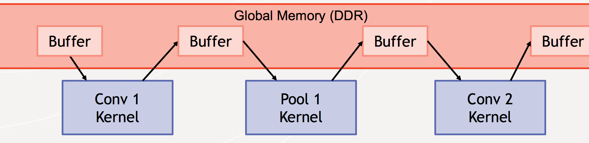
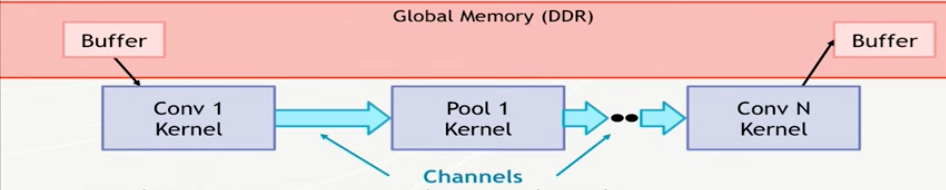

# Some notes on Optimization


### GlobalSize/localSize

Modify `globalsize/localsize/offset` in [network-config.json](../convertor/output/mnist-config.json) that generated, after you change the config JSON file, run this to apply config to network JSON.

```shell
python ./convertor/src/applyConfig.py  --net ./convertor/output/mnist.json  -config ./convertor/output/mnist-config.json   --output [by default same with --net]
```


### Memory Bandwidth

:warning:  On Chip buffer has bugs right now. :warning:  

It supports two mode
- OpenCL 1.2 mode, outputFeatureMap to external memory traffic for each layer, low performance.
     
- OpenCL 2.0 mode, intermediate Feature maps are stored in on-chip buffer, less memory traffic needed with PingPong Buffer.
     

To use the first one:

1. use the `-v 12` program parameter
2. comment out the `#define BUFFER_SIZE N`  in [net.cl](../kernels/net/net.cl)


To use the second one:

1. use `-v 20`
2. uncomment


### Attributes

For example:


- `Unroll`
- `Pipeline Loop`
- `Pipeline work item`


More details in [xilinx sdaccel optimization document](https://www.xilinx.com/support/documentation/sw_manuals/ug1207-sdaccel-performance-optimization.pdf). Right now I haven't add them in the [net.cl](../kernels/net/net.cl).  But you can feel free to do so.


### Mathematical model

Use some model to find the best pipeline/unroll parameters, this paper is a very good start: [Optimizing FPGA-based Accelerator Design for Deep Convolutional Neural Networks](http://dl.acm.org/citation.cfm?id=2689060). 
