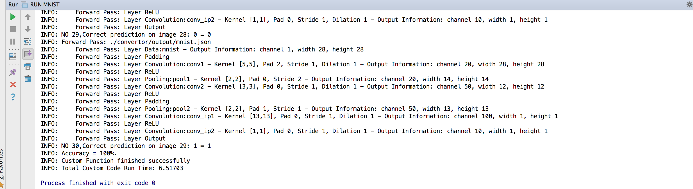

# Step by Step of a MNIST Demo

## a. Train your own network

```shell
cd ./convertor/data/mnist

# change snapshot_prefix to be your path
vim solver.prototxt

# change Datalayer.data_param.source to be your path
vim train.prototxt

caffe train --solver=solver.prototxt

# when finished, named
# the final snapshot.caffemodel to be model.caffemodel
```

## b. Convert Caffe Model into JSON

```
cd ./convertor/src
python convert.py  -m  ../data/mnist/model.caffemodel  -p  ../data/mnist/train.prototxt  -o  ../output  --name mnist

# this will generate
# - ../output/mnist.json
# - ../output/mnist-config.json
```

You only need the `mnist.json` afterwards, but the `mnist-config.json` is used to define `OpenCL globalSize/localSize` for each layer.

## c. Add OpenCL Work-Group-Item Configuration

`mnist-config.json` looks like:

```json
{
"layers": [
    {
        "config": {
            "global_size": [
                1,
                1,
                1
            ],
            "local_size": [
                1,
                1,
                1
            ],
            "offset": [
                0,
                0,
                0
            ]
        },
        "input_channel": 1,
        "input_height": 28,
        "input_width": 28,
        "output_channel": 1,
        "output_height": 28,
        "output_width": 28,
        "type": "Data"
    }, ...]
}    
```

1. Customize `config` for each layer
2. Add Configuration `mnist-config.json` information to `mnist.json` by

```shell
# this will insert configuration info to mnist.json
python applyConfig.py -n ../output/mnist.json -c ../output/mnist-config.json  
```


### d. Edit/Read some CPP code

Open [../cpp/custom.h](../cpp/custom.h) and [../cpp/custom.cpp](../cpp/custom.cpp), you won't need edit them because they are already written. But you could see how the JSON file is readed, and parsed into network. And how the network get executed.


### e. Run the CPU demo in your mac laptop, using Makefile provided.

```shell
cd /path/to/repo
source env.sh
cd ./build/output
cp ../resources/Makefile_templates/Makefile.mac.cpu  ./Makefile  
make
./network_cpu.exe -h # to see help on program parameter
make run
```


### f. Run the Demo in your own laptop with CPU with CLion

1. Open CLion, and open this source folder in CLion

2. Make sure it can parse `CMakeLists.txt` correctly.

3. **Edit Configurations** -> **Add New** and set options:
    - Working Directory: Top source folder
    - Program Parameters:
    ```
    -f ./kernels/net/net.cl  -k dataLayer,outputLayer,convLayer,paddingLayer,reluLayer,poolingLayer  -n ./convertor/output/mnist.json -d cpu -l layer -i 30
    ```

4. Click Run, and enter `y` and `<enter>` in the console to confirm.

5. Result will be like below, if not then error happens. Please check the console logging output, which is very detailed.




6. Here are the explains of the program parameters above:


```
network_cpu.exe: option requires an argument -- h
usage: %s <options>
  -f <kernel_file>   kernel source/binary file path, required

  -k <kernel_name1,kernel_name2>  kernels to compile, required

  -n <network file>  network json file that converted by python script, required

  -d <cpu|gpu|fpga> device type, default cpu in apple, otherwise fpga

  -l <no|layer|net|debug> network logging level, debug will print feature map

  -c <0|1|2> device index to choose, choose first available device by default

  -v <12|20> opencl version

  -p <Xilinx|Apple|'NVIDIA CUDA'> platform to choose, by default Apple in mac, Xilinx otherwise.

  -i <extra information> parse it in your own custom run function, here means the number of mnist images used

  -h <print help info>
```


### g. Run the demo with GPU [Optional]

Centos6 tested and Makefile provided, other OS should be similar

```shell
cd /path/to/repo
source env.sh
cd ./build/output
cp ../resources/Makefile_templates/Makefile.centos6.gpu  ./Makefile  

# modify the Cuda, OpenCV library path config
# to your own correct values in Makefile
vim ./Makefile  

make && make run
```

### h. Run the demo with FPGA

```shell
cd /path/to/repo

 # modify these two variable to your own
 # - SDACCEL_HOME
 # - FPGA
vim env.sh

cd ./build/output
cp ../resources/Makefile_templates/Makefile.fgpa.tcl ./net.tcl

sdaccel ./net.tcl

fpga_hw_env # a function defined in env.sh, set the correct LD_LIBRARY_PATH for FPGA

cd ./network_fpga/pkg/pcie/  

./network_fpga.exe  -f ./net.cl.hw.xclbin  -k convLayer,paddingLayer,poolingLayer,dataLayer,outputLayer,reluLayer  -n $(CAFFE_FPGA_CL_HOME)/convertor/output/mnist.json  -v 20 -l layer -i 30
```


### Extra

How to add more debug printing when you execute the code on FPGA?
- uncomment `#define DEBUG` in [net.cl](../kernels/net/net.cl). Then the code will transfer feature map to host memory no matter on-chip cache is used or not.
- In the same time, use `-l debug` for `network_fpga.exe`. Then it will print out intermediate feature map on the console.
